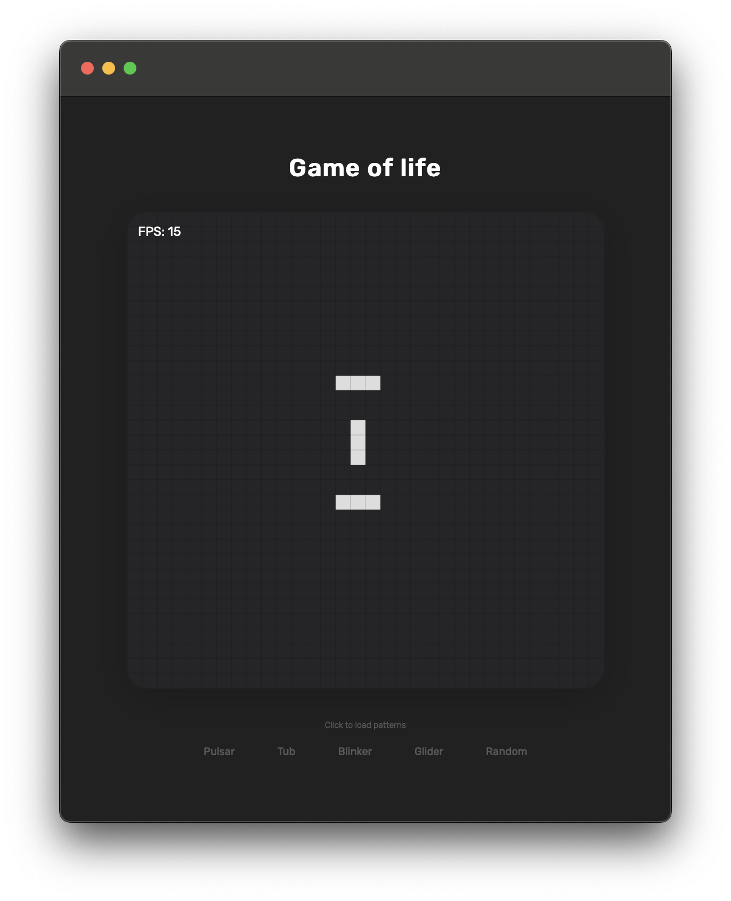
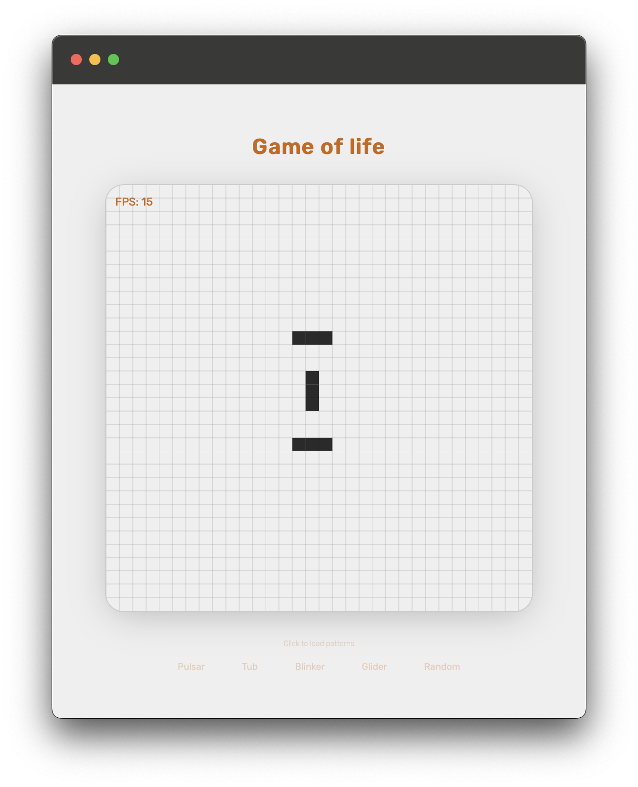

# JS Game of life

Javascript implementation of [Conway's Game of Life](https://en.wikipedia.org/wiki/Conway%27s_Game_of_Life).

    

        
		&nbsp;&nbsp;&nbsp;
        
    

	<a href="https://leandrosq.github.io/js-game-of-life/">Live demo here</a>

## Features

- Light and Dark mode
- Mobile support
- Vanilla JS

## Project

| Name | Description |
| -- | -- |
| Eslint | For linting and semantic analysis |
| Github actions | For CI, building and deploying to github pages |
| [Google fonts](https://fonts.google.com/) | For the [Rubik](https://fonts.google.com/specimen/Rubik) font |
